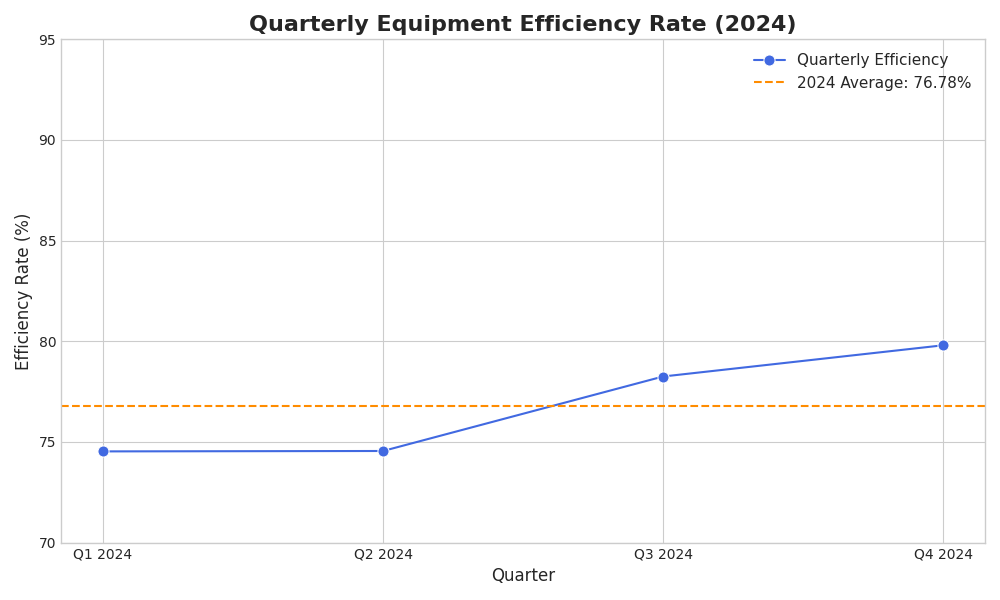
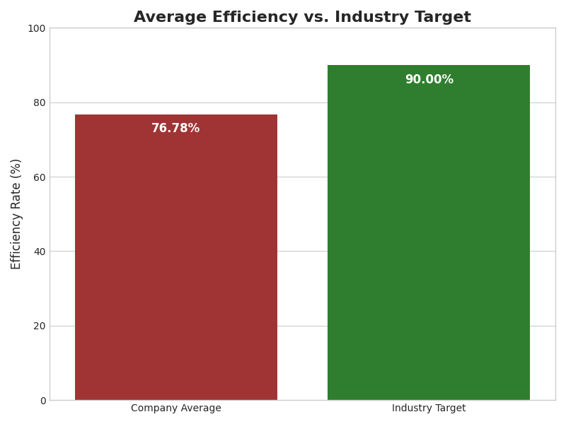

# Manufacturing Performance Analysis & Predictive Maintenance Proposal

This report provides a data-driven analysis of our equipment efficiency throughout 2024. The findings highlight a significant performance gap and outline a clear path forward to enhance operational efficiency, reduce costs, and regain our competitive edge.

---

## Key Findings

Our analysis of the 2024 quarterly data reveals two critical insights:

1.  **Significant Performance Gap**: Our average equipment efficiency rate for 2024 is **76.78%**. This is **13.22 percentage points below** the industry benchmark target of 90%. This gap represents a substantial loss of potential production capacity.

2.  **Slow Growth Trend**: While efficiency showed a modest improvement from 74.53% in Q1 to 79.80% in Q4, this growth rate is insufficient to reach the industry target in the near future. The current reactive and preventive maintenance strategies are not closing the performance gap fast enough.

---

## Data Visualizations

The following charts illustrate our current performance and the challenge ahead.

### Quarterly Equipment Efficiency Trend (2024)

This chart shows the slight upward trend in efficiency over the four quarters, alongside the year's average.

*`quarterly_trend.png` generated by `analysis.py`*

### Average Efficiency vs. Industry Target

This chart starkly visualizes the gap between our current average performance and the industry benchmark we must achieve.

*`benchmark_comparison.png` generated by `analysis.py`*

---

## Business Implications

The current efficiency rate of 76.78% has direct and severe consequences for the business:

* **Increased Operational Costs**: Unplanned downtime and reactive maintenance are more expensive than scheduled, proactive interventions. Every percentage point below the target translates to lost productivity and higher repair costs.
* **Reduced Production Output**: Inefficiency directly limits our manufacturing capacity, creating a risk of missing production targets, delaying customer orders, and losing revenue.
* **Competitive Disadvantage**: Competitors operating at or near the 90% benchmark are more productive and profitable. Falling behind weakens our market position and long-term viability.

---

## The Solution: Implement a Predictive Maintenance Program 🎯

To bridge the 13.22-point efficiency gap and mitigate the associated business risks, a strategic shift is necessary. We must move from a reactive maintenance culture to a proactive, data-driven one.

**Our primary recommendation is to implement a comprehensive predictive maintenance program.**

A predictive maintenance program uses data sensors and advanced analytics to monitor equipment health in real-time. Instead of repairing equipment after it fails (reactive) or on a fixed schedule (preventive), this approach allows us to **predict potential failures before they occur**.

### Actionable Steps & Benefits:

1.  **Deploy IoT Sensors**: Install sensors on critical machinery to collect real-time data on parameters like temperature, vibration, and performance.
2.  **Leverage Data Analytics**: Use machine learning algorithms to analyze this data, identify patterns that precede failures, and generate alerts for the maintenance team.
3.  **Optimize Maintenance Scheduling**: Perform maintenance precisely when needed, minimizing both unplanned downtime and unnecessary servicing of healthy equipment.

By adopting this strategy, we can directly address the root causes of our inefficiency, leading to **reduced downtime, lower maintenance costs, and a significant boost in our equipment efficiency rate toward the 90% target.**